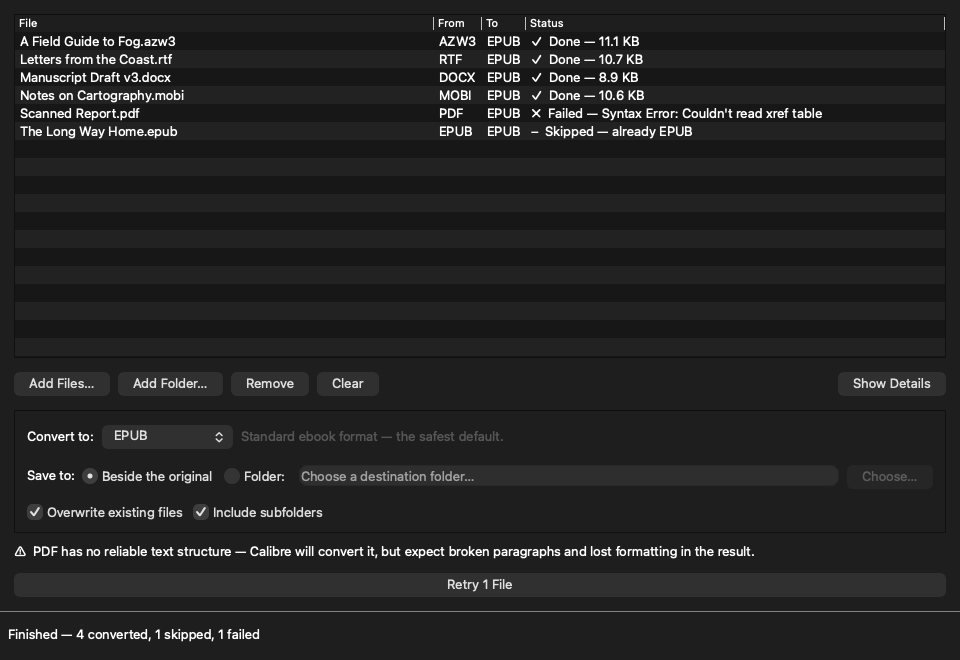

# Ebook Converter

A macOS drag-and-drop converter for ebooks and documents. Drop files or folders,
pick a target format, convert. Any format Calibre can read becomes any format
Calibre can write — **47 input formats, 19 output formats**.



## What it does

| | |
|---|---|
| **Drop anything** | Single files, a mixed selection, or whole folders — dropped onto the window or added with **Add Files…** / **Add Folder…** |
| **Any → any** | EPUB, AZW3, MOBI, DOCX, PDF, TXT, RTF, FB2, KEPUB, LIT, LRF, HTMLZ and more, in both directions |
| **Live queue** | Every file shows its source format, its destination, and what will happen to it — before you commit |
| **Output where you want it** | Beside the original, or collected into one folder (name collisions get a `-2` suffix, they never overwrite each other) |
| **Skips instead of clobbering** | Files already in the target format and existing outputs are skipped unless you turn on overwrite |
| **Survives bad files** | One unreadable file fails on its own row with Calibre's reason; the rest of the queue carries on. **Retry** re-queues the failures |

## Requirements

Conversion is done by [Calibre](https://calibre-ebook.com)'s `ebook-convert`, which
is **not bundled** — that keeps the app at ~98 MB instead of adding Calibre's few
hundred, and Calibre updates apply without rebuilding.

```bash
brew install --cask calibre
```

If the command-line tools are not registered afterwards:

```bash
/Applications/calibre.app/Contents/MacOS/calibre_postinstall
```

The app looks for `ebook-convert` on `PATH`, then in `/opt/homebrew/bin`,
`/usr/local/bin`, and inside `calibre.app`. Without it the window still opens
and says so, with a **Recheck** button in the status bar.

## Running from source

```bash
uv venv && uv pip install -r requirements.txt && python main.py
```

## Building the app

```bash
./build_app.sh --install
```

Builds `Ebook Converter.app`, runs the self-test against the packaged binary,
and copies it to `/Applications`. Without `--install` the bundle is left in
`dist.noindex/` (named so Spotlight ignores it — a built `.app` under
`~/Documents` otherwise shows up as a duplicate of the installed one).

## Layout

| Path | |
|---|---|
| `main.py` | Entry point. `--selftest` checks a build's wiring and exits |
| `ebook_converter/formats.py` | What Calibre reads and writes, pinned and verified against the installed Calibre |
| `ebook_converter/calibre.py` | Finding and running `ebook-convert` |
| `ebook_converter/jobs.py` | Expanding dropped paths into a plan: what converts, where to, what gets skipped |
| `ebook_converter/runner.py` | Executing one job |
| `ebook_converter/config.py` | Settings in `~/Library/Application Support/Ebook Converter/` |
| `ui/main_window.py` | The window |
| `ui/worker.py` | The background conversion thread |
| `assets/make_icon.py` | Regenerates `icon.icns` (run by `build_app.sh`) |

## Notes on formats

**PDF, DjVu and comic formats are poor inputs.** Calibre will convert them, but
they carry no reliable text structure, so expect broken paragraphs and lost
formatting. The app warns when one is queued rather than refusing it.

**KEPUB is written as `.kepub.epub`.** Calibre picks its output plugin from the
file extension and writes `.kepub`; Kobo devices only recognise the compound
form, so the app renames the finished file.

**The format lists are pinned, not queried.** Reading them from Calibre at
runtime would mean depending on its Python interpreter rather than just the
`ebook-convert` binary. `formats.missing_from_calibre()` re-checks the pinned
lists whenever Calibre's packages happen to be importable, and the test suite
fails if a Calibre update adds a format the picker is hiding.

## Tests

```bash
uv pip install -r requirements-dev.txt && pytest
```

`pytest -m "not slow"` skips the integration tests, which run real conversions
through Calibre (EPUB → PDF/AZW3/MOBI/DOCX/TXT/RTF/FB2 and back again). The
whole suite is skipped automatically when Calibre is not installed.

## Self-test

```bash
python main.py --selftest
```

Prints where the config and icon resolve to, which `ebook-convert` was found,
and converts a real file end to end. `build_app.sh` runs it against the packaged
binary, because two failures are only possible once packaged: an app launched
from Finder inherits a bare `PATH` and finds no Calibre, and PyInstaller rewrites
the dynamic-linker environment in a way that can make the Calibre subprocess
load the wrong libraries and die.

## History

This started as a ~110-line script that walked one hardcoded Google Drive folder
converting `.epub` to `.pdf`. The conversion call it used is still the core of
`calibre.py`; everything else is new.
